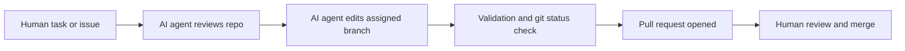

# cursor_hackathon_prototype

## Simple Full-Stack Golfing Application Design

This project can grow into a simple full-stack golfing application that helps
players plan rounds, track scorecards, and review basic performance trends.

### Product goals

- Let golfers create an account and manage their profile.
- Show nearby or saved golf courses with hole-by-hole information.
- Allow players to start a round, enter scores, and save completed scorecards.
- Summarize recent rounds with basic stats such as total score, fairways hit,
  greens in regulation, putts, and score relative to par.
- Keep the first version small enough to build, run, and deploy with a minimal
  web client, API service, and database.

### Suggested user flows

1. A player signs up or signs in.
2. The player selects an existing course or creates a simple custom course.
3. The player starts a round and records per-hole score details.
4. The player completes the round and reviews a scorecard summary.
5. The dashboard lists recent rounds and highlights simple trends.

### Recommended architecture

- **Frontend:** React or Next.js app with pages for authentication, dashboard,
  course selection, active scorecard entry, and round history.
- **Backend:** REST or lightweight GraphQL API that owns authentication,
  validation, course data, rounds, and scorecard persistence.
- **Database:** PostgreSQL for relational data such as users, courses, holes,
  rounds, and per-hole scores.
- **Authentication:** Email/password or managed auth provider, with authenticated
  API requests scoped to the current player.
- **Deployment:** A hosted frontend, API service, and managed database. Keep
  environment variables for secrets and database URLs outside source control.

### Current frontend prototype

This repository now includes a simple Vite + React frontend named Fairway Log.
It is a static prototype of the MVP experience with dashboard metrics, saved
course cards, an active scorecard preview, and recent round history. The app
is organized with component-style architecture: focused React components live
under `src/components`, shared sample data lives under `src/data`, domain types
live under `src/types`, and small calculations live under `src/utils`. It uses
local sample data only; backend APIs, authentication, and persistence are future
work.

Run it locally:

```sh
npm install
npm run dev
```

Build the production bundle:

```sh
npm run build
```

### Initial data model

- **User:** id, name, email, handicap, created timestamp.
- **Course:** id, name, location, par, total yardage, owner or public flag.
- **Hole:** id, course id, hole number, par, yardage, handicap index.
- **Round:** id, user id, course id, played date, status, total score.
- **HoleScore:** id, round id, hole id, strokes, putts, fairway hit, green in
  regulation, penalties.

### API surface for a first version

- `POST /auth/signup` and `POST /auth/login` for account access.
- `GET /courses` and `POST /courses` for browsing and creating courses.
- `GET /courses/:id` for course details with holes.
- `POST /rounds` to start a round.
- `PATCH /rounds/:id/scores/:holeId` to update a hole score.
- `POST /rounds/:id/complete` to finalize totals and stats.
- `GET /rounds` and `GET /rounds/:id` for round history and scorecard review.

### MVP build plan

1. Define the database schema and seed a few sample courses.
2. Build authentication and protected API routes.
3. Create dashboard, course list, and round history pages.
4. Implement scorecard entry with offline-friendly local form state.
5. Add round completion logic that calculates totals and basic stats.
6. Add focused tests for score calculations, API validation, and critical user
   flows.

### Future enhancements

- Course search by location and favorite courses.
- Handicap tracking and scoring formats such as match play or Stableford.
- Shot tracking, club distances, and richer trend charts.
- Social features for groups, tee times, and shared leaderboards.
- Mobile-first polish for on-course score entry.

## How agents run this repo

### AI-run workflow

This repository workflow is run by AI agents. A human provides the task or issue,
then an AI agent reviews the repository, makes focused changes on the assigned
branch, validates the result, and opens a pull request for human review.



Agents should work from the repository root and stay on the assigned feature
branch for the task. Start each run by confirming the workspace and branch:

```sh
cd /workspace
git status --short --branch
```

This repository contains a Vite + React frontend prototype. Agent runs that
modify executable code should install dependencies and run the production build
before committing.

Recommended workflow:

1. Confirm the current branch matches the assigned task branch.
2. Review `README.md` and any task-specific instructions before editing.
3. Install dependencies when needed:

   ```sh
   npm install
   ```

4. Make focused changes from the repository root.
5. Validate the final state before committing:

   ```sh
   npm run build
   git diff
   git status --short --branch
   ```

6. Commit and push changes on the assigned branch, then open or update the pull
   request for that branch.

For documentation-only changes, the build command may be skipped if no
executable code or dependencies changed.

Current application commands:

   ```sh
   npm run dev      # start the local development server
   npm run build    # type-check and create the production bundle
   npm run preview  # preview the production bundle locally
   ```
